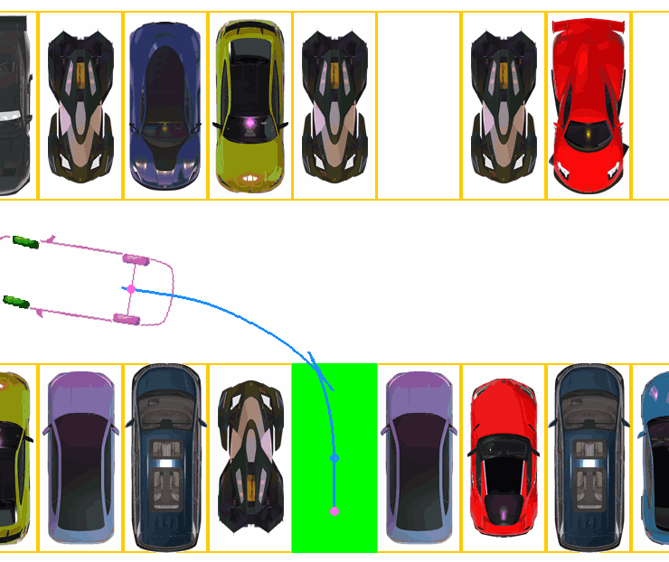

# Reinforcement_Learning_Parking_LM-SAC
**Paper**:  [Advancing Narrow Space Parking with Latent Memory-Based Reinforcement Learning](https://ieeexplore.ieee.org/abstract/document/11097572)

**Conference**:  The IEEE INTELLIGENT VEHICLES SYMPOSIUM ([IV 2025](https://ieee-iv.org/2025/))

### Method Display

<div align="center">
  
</div>

### Contributions
- A Latent Memory-Based Soft Actor-Critic (LM-SAC) algorithm was proposed, which leverages latent memory to implicitly store contextual information during the parking process, enabling the agent to precisely maneuver in confined spaces.
- A Progressive Milestone Training (PMT) method is developed that decomposes the task into a series of intermediate subtasks and integrates curriculum learning to enhance the training efficiency.
- A customized virtual parking environment tailored for narrow spaces was proposed. Surrounding obstacle information is encoded using Virtual-LiDAR Detection (VLD), which significantly reduces the input dimensionality and is compatible with various perception formats.


### Performance in several different scenarios
<div align="center">
<table>
  <tr>
    <td align="center">  </td>
    <td align="center">  </td>
    <td align="center">  </td>
    <td align="center">  </td>
  </tr>
  <tr>
    <td align="center">  </td>
    <td align="center">  </td>
    <td align="center">  </td>
    <td align="center">  </td>
  </tr>
  <tr>
    <td align="center">  </td>
    <td align="center">  </td>
    <td align="center">  </td>
    <td align="center">  </td>
  </tr>

</table>
</div>

### Comparison of different algorithms in the same scenario

<div align="center">
<table>
  <tr>
    <td align="center"> A* 6-nodes </td>
    <td align="center"> A* more-nodes </td>
    <td align="center"> LM-SAC </td>
  </tr>
  <tr>
    <td align="center">  </td>
    <td align="center">  </td>
    <td align="center">  </td>
  </tr>

</table>
</div>


## Bibtex
If this work is helpful for your research, please consider citing the following BibTeX entry.
```bibtex
@inproceedings{zhong2025advancing,
  title={Advancing Narrow Space Parking with Latent Memory-Based Reinforcement Learning},
  author={Zhong, Yilin and Gan, Shun and Fan, Bo and Cheng, Jun and Chen, Tao and Shi, Qian},
  booktitle={2025 IEEE Intelligent Vehicles Symposium (IV)},
  pages={2273--2280},
  year={2025},
  organization={IEEE}
}
```


