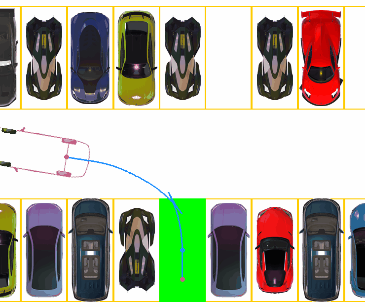
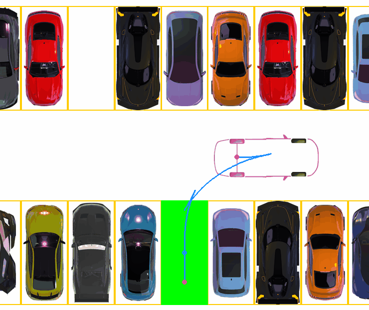
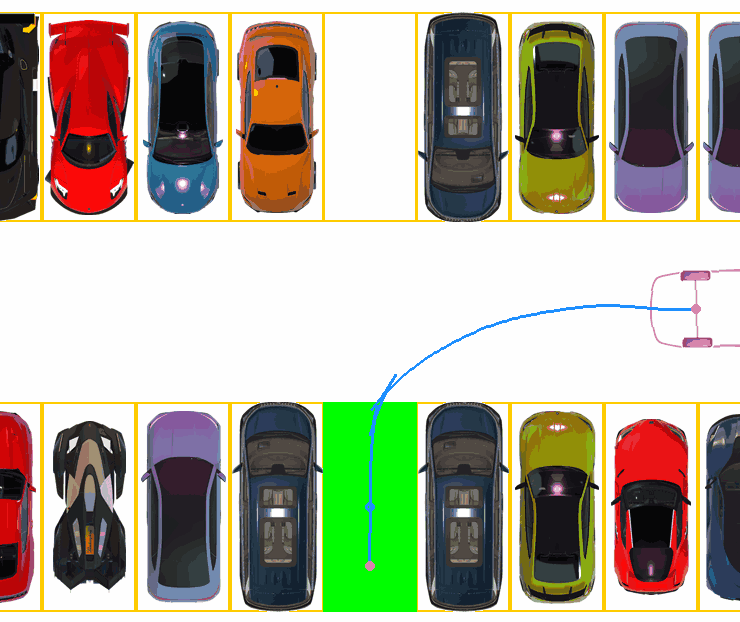
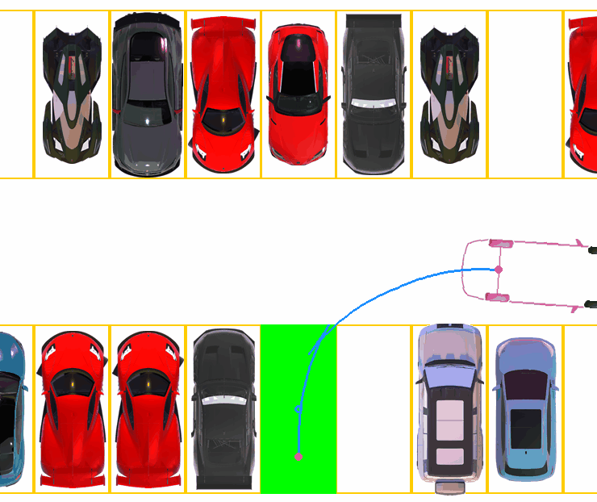
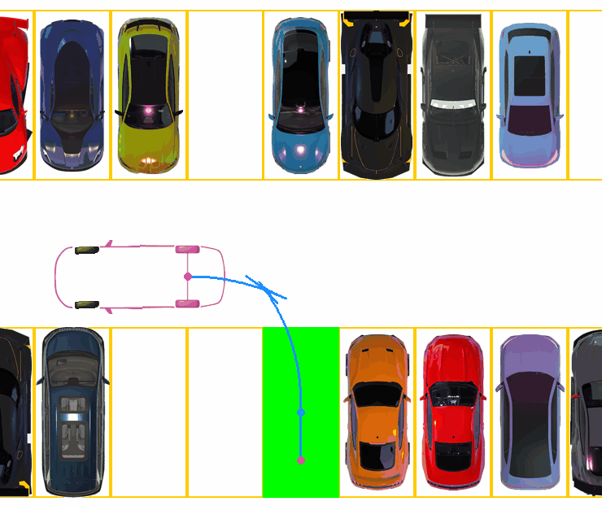
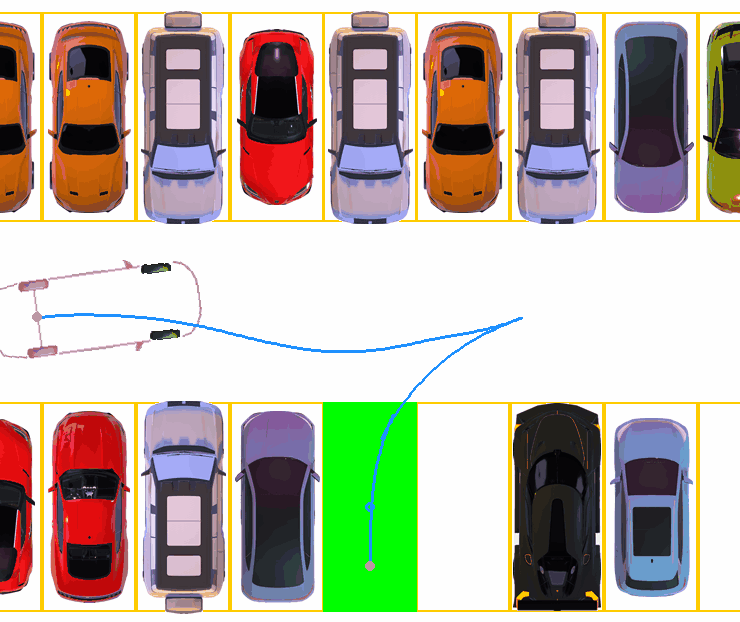
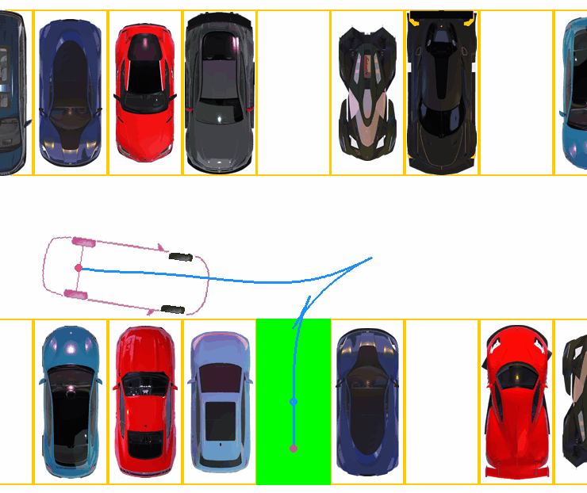

# Reinforcement_Learning_Parking_LM-SAC
Paper: Advancing Narrow Space Parking with Latent Memory-Based Reinforcement Learning

Conference: The IEEE INTELLIGENT VEHICLES SYMPOSIUM ([IV 2025](https://ieee-iv.org/2025/))

### Method Display

  

### Contributions
- A Latent Memory-Based Soft Actor-Critic (LM-SAC) algorithm was proposed, which leverages latent memory to implicitly store contextual information during the parking process, enabling the agent to precisely maneuver in confined spaces.
- A Progressive Milestone Training (PMT) method is developed that decomposes the task into a series of intermediate subtasks and integrates curriculum learning to enhance the training efficiency.
- A customized virtual parking environment tailored for narrow spaces was proposed. Surrounding obstacle information is encoded using Virtual-LiDAR Detection (VLD), which significantly reduces the input dimensionality and is compatible with various perception formats.

### Performance in several different scenarios
<table>
  <tr>
    <td align="center">  </td>
    <td align="center">  </td>
    <td align="center">  </td>
    <td align="center">  </td>
  </tr>
  <tr>
    <td align="center">  </td>
    <td align="center">  </td>
    <td align="center">  </td>
    <td align="center">  </td>
  </tr>
  <tr>
    <td align="center">  </td>
    <td align="center">  </td>
    <td align="center">  </td>
    <td align="center">  </td>
  </tr>

</table>

### Comparison with Hybrid A*

